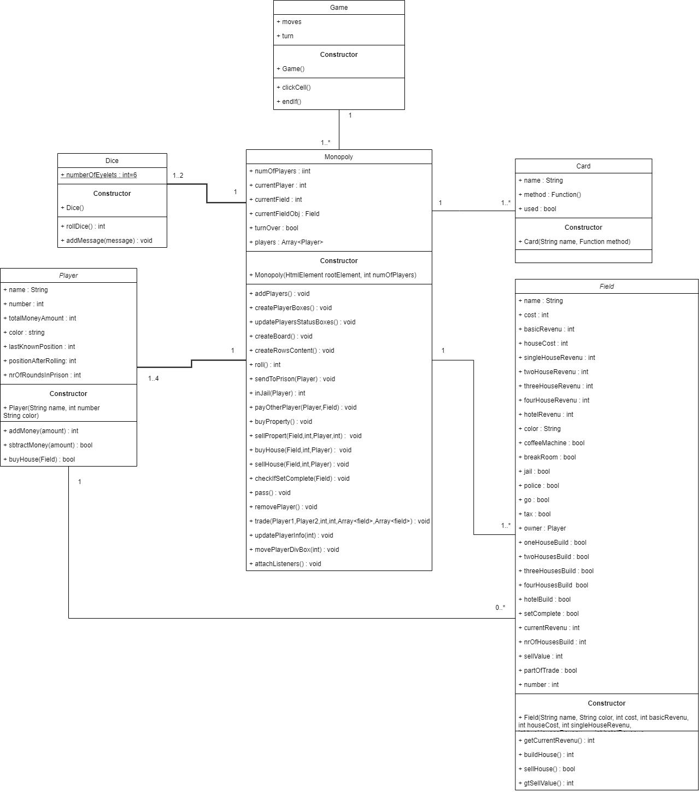

# StartDocument

| Student name     | Student number | Version |
| :--------------- | :------------- | ------- |
| Marek Stryjenski | 4716779        | 2.0     |

## Problem Definition

For the final assignment I decided to make in javascript the game that was created in 1935. The game that everyone knows and at least played once in their life. The game that either makes you a millionaire or makes you rage quit. The same game that influenced greatly the life of non other than **Bill Gates** himself *(True story)*. Have you guessed it yet? 

You are right, as a part of my project I am creating League of Legends 2 :smile:. Of course, I am joking (pls don't fail me).

What I am really creating is: 

#### <u>MONOPOLY: NHL STENDEN EDITION</u>

The game will follow mostly the same rules and structure as monopoly original version with few minor changes. In case you truly never played monopoly, here is the link to the website that explains the game https://www.ultraboardgames.com/monopoly/game-rules.php

The game will consists of max 4 players and min 2. It will be developed using Html, Css, Javascript and Javascript libraries that may deem to be necessary. Since this is the NhlStenden edition, fields and cards will resemble the general NhlStenden theme.

To develop the game I will be using nodeJs libraries and boardgam.io framework

In the following chapters of this document, you will find the definition of the classes, inputs, outputs, Class Diagram and finally test plan and test cases. 

*The class names, fields, methods, cards etc. are named based on the original monopoly game rules and structure, since it is easier for me to code and for you to understand what I am doing. During development I will change the output of the methods to make it fell more like Monopoly NhlStenden Edition.*

## UML CLASS DIAGRAM


## Defining Classes

- Game
  - moves
  - turn
  
- Dice
  - numberOfEyelets
  
- Player
  - name
  - number
  - totalMoneyAmount
  - color
  - lastKnownPosition
  - positionAfterRolling
  - nrOfRoundsInPrison
  
- Field
  - ```
    this.name = name;
    this.cost = cost;
    this.basicRevenue = basicRevenue;
    this.houseCost = houseCost;
    this.singleHouseRevenue = singleHouseRevenue;
    this.twoHouseRevenue = twoHouseRevenue;
    this.threeHouseRevenue = threeHouseRevenue;
    this.fourHouseRevenue = fourHouseRevenue;
    this.hotelRevenue = hotelRevenue;
    this.color = color;
    this.coffeeMachine = false;
    this.breakRoom=false;
    this.jail = false;
    this.police=false;
    this.go = false;
    this.tax = false;
    this.owner = null;
    this.oneHouseBuild = false;
    this.twoHousesBuild = false;
    this.threeHousesBuild = false;
    this.fourHousesBuild = false;
    this.hotelBuild = false;
    this.setComplete = false;
    this.currentRevenue = 0;
    this.nrOfHousesBuild = 0;
    this.sellValue = 0;
    this.partOfTrade=false;
    this.number=0;
    ```
  
- Monopoly

  - numOfPlayers
  - currentPlayer
  - currentField
  - currentFieldObj
  - turnOver
  - players

*The classes can change during development.*

## Required input

The following table contains the required input for this system to work:

| Case                    | Type   | Condition |
| ----------------------- | ------ | --------- |
| Player name             | String | !=null    |
| Field name              | String | !=null    |
| Field color             | String | !=null    |
| Field basicRevenue      | int    | !=null    |
| Field house cost        | int    | !=null    |
| field singleHouseRevenu | int    | !=null    |
| field twoHouseRevenu    | int    | !=null    |
| field threeHouseRevenu  | int    | !=null    |
| field fourHouseRevenu   | int    | !=null    |
| field hoteRevenue       | int    | !=null    |
| Field cost              | int    | !=null    |
| NumOfPlayers            | int    | !=null    |
| Player cost             | int    | !=null    |
| Player number           | int    | !=null    |

## Required output

The following table contains the output of the system. It will be displayed on the website:

| Case                         | Type   |
| ---------------------------- | ------ |
| start                        | void   |
| end                          | void   |
| rollDices                    | int    |
| movePlayer                   | String |
| howMuchMoneyPlayerHas        | int    |
| purchaseField                | bool   |
| purchaseHouse                | bool   |
| sellField                    | bool   |
| sellHouse                    | bool   |
| checkIfOwned                 | Player |
| checkFieldType               | Field  |
| fieldRevenue                 | int    |
| givePlayerAllMoney           | bool   |
| releasePrisoner              | bool   |
| addPrisoner                  | bool   |
| playerCrossesStart           | bool   |
| whatFieldDoes                | String |
| takeFromPlayer               | int    |
| takeFromPlayerFiveAllPlayers | bool   |
| giveAllPlayersMoney          | bool   |
| movePlayerForward            | bool   |
| goToPrison                   | bool   |
| movePlayerOnStart            | bool   |
| makeTrade                    | void   |

**Remarks:**

- Data that user inputs will be validated
- Game session must have at least one player and max 4 players
- Same field cannot be owned by two different players at the same time
- There are only four train stations and 2 pipelines
- Each owned train station by player increases revenue by 50. E.g If you are in possession of two you will gain 100 any time player enters one of your train stations
- Sell value is equal to half of the original price
- Before player can sell the field, he must sell first all the houses on the property
- Player can only trade with another player when it is his turn
- In jail player have to wait two rounds to get out
- Cards are created before the game starts. User cannot create cards, he can only use them if he enters treasure chest field
- Number of fields, their position, color of properties etc. is based on the original monopoly game:
  -  https://m.media-amazon.com/images/I/81btrHKgO0L._AC_.jpg 
  - https://www.renderhub.com/dcbittorf/monopoly-properties/monopoly-properties-03.jpg
- Player must own the complete color set to put there any houses

## Test plan

Test data for **Dice**

| #    | Dice  |
| :--- | ----- |
| 1    | Dice1 |
| 2    | Dice2 |

Test data for **Player**

| #    | name  | playerNumber | totalMoneyAmount | pawnImageDirectory |
| ---- | ----- | ------------ | ---------------- | ------------------ |
| 1    | Marek | 1            | 900              | imgs/broke.png     |
| 2    | Elon  | 2            | 300              | imgs/dogecoin.jpg  |

Test data for **PipeLine**

| #    | name          | bought | owner | currentRevenue |
| ---- | ------------- | ------ | ----- | -------------- |
| 1    | WaterPipeLine | true   | Marek | 4xDiceEyelets  |
| 2    | GasPipeLine   | false  | null  | 4xDiceEyelets  |

Test data for **Property**

| #    | Name                | cost | bought | owner | sellValue | color     | basicRevenue | currentRevenue | houseCost | hotel | nrOfHousesOnField | imageDirectory                     |
| ---- | ------------------- | ---- | ------ | ----- | --------- | --------- | ------------ | -------------- | --------- | ----- | ----------------- | ---------------------------------- |
| 1    | Mediterian Avenue   | 60   | false  | null  | 30        | Brown     | 2            | 2              | 50        | false | 0                 | imgs/fields/property/brown.png     |
| 2    | Baltic Avenue       | 60   | true   | Marek | 30        | Brown     | 4            | 4              | 50        | false | 0                 | imgs/fields/property/brown.png     |
| 3    | Vermont Avenue      | 100  | false  | null  | 50        | LightBlue | 6            | 6              | 50        | false | 0                 | imgs/fields/property/lightBlue.png |
| 4    | Oriental Avenue     | 100  | false  | null  | 50        | LightBlue | 6            | 6              | 50        | false | 0                 | imgs/fields/property/lightBlue.png |
| 5    | Connecticut Avenue  | 120  | false  | null  | 60        | LightBlue | 8            | 8              | 50        | false | 0                 | imgs/fields/property/lightBlue.png |
| 6    | St.Charles          | 140  | true   | Marek | 70        | Pink      | 10           | 150            | 100       | false | 2                 | imgs/fields/property/pink.png      |
| 7    | States Avenue       | 140  | true   | Marek | 70        | Pink      | 10           | 10             | 100       | false | 0                 | imgs/fields/property/pink.png      |
| 8    | Virginia avenue     | 160  | true   | Marek | 80        | Pink      | 12           | 12             | 100       | false | 0                 | imgs/fields/property/pink.png      |
| 9    | St.James Place      | 180  | false  | null  | 90        | Orange    | 14           | 14             | 100       | false | 0                 | imgs/fields/property/orange.png    |
| 10   | St.Tennessee Avenue | 180  | false  | null  | 90        | Orange    | 14           | 14             | 100       | false | 0                 | imgs/fields/property/orange.png    |
| 11   | New York            | 200  | false  | null  | 100       | Orange    | 16           | 16             | 100       | false | 0                 | imgs/fields/property/orange.png    |
| 12   | Kenctucky           | 220  | true   | Marek | 110       | Red       | 18           | 18             | 150       | false | 0                 | imgs/fields/property/red.png       |
| 13   | Kenctucky           | 220  | true   | Marek | 110       | Red       | 18           | 18             | 150       | false | 0                 | imgs/fields/property/red.png       |
| 14   | Illanois            | 240  | true   | Marek | 120       | Red       | 20           | 20             | 150       | false | 0                 | imgs/fields/property/red.png       |
| 15   | Atlantic            | 260  | false  | null  | 130       | Yellow    | 22           | 22             | 150       | false | 0                 | imgs/fields/property/yellow.png    |
| 16   | Ventor              | 260  | false  | null  | 130       | Yellow    | 22           | 22             | 150       | false | 0                 | imgs/fields/property/yellow.png    |
| 17   | Marvin              | 280  | false  | null  | 140       | Yellow    | 24           | 24             | 150       | false | 0                 | imgs/fields/property/yellow.png    |
| 18   | Pacific             | 300  | false  | null  | 150       | Green     | 26           | 26             | 200       | false | 0                 | imgs/fields/property/green.png     |
| 19   | North Carolina      | 300  | false  | null  | 150       | Green     | 26           | 26             | 200       | false | 0                 | imgs/fields/property/green.png     |
| 20   | Pennsylvenia        | 320  | false  | null  | 160       | Green     | 28           | 28             | 200       | false | 0                 | imgs/fields/property/green.png     |
| 21   | Park Place          | 350  | true   | Elon  | 175       | DarkBlue  | 35           | 1300           | 200       | true  | 4                 | imgs/fields/property/darkBlue.png  |
| 22   | BoardWalk           | 400  | true   | Elon  | 200       | DarkBlue  | 50           | 2000           | 200       | true  | 5                 | imgs/fields/property/darkBlue.png  |

Test data for **TrainStation**

| #    | name                  | bought | owner | currentRevenue | imageDirectory                             |
| ---- | --------------------- | ------ | ----- | -------------- | ------------------------------------------ |
| 1    | Reading Railroad      | true   | Elon  | 100            | imgs/fields/trainstation/trainstation1.png |
| 2    | Pennsylvania Railroad | false  | null  | 50             | imgs/fields/trainstation/trainstation2.png |
| 3    | BDB Railroad          | false  | null  | 50             | imgs/fields/trainstation/trainstation3.png |
| 4    | Thomas Railroad       | true   | Elon  | 100            | imgs/fields/trainstation/trainstation4.png |

Test data for **Parking**

| #    | name    |
| ---- | ------- |
| 1    | Parking |

Test data for **Prison**

| #    | name   |
| ---- | ------ |
| 1    | Prison |

Test data for **Start**

| #    | name  |
| ---- | ----- |
| 1    | Start |

Test data for **TreasureChest**

| #    | nrOfCardsLeftInChest |
| ---- | -------------------- |
| 1    | 20                   |
| 2    | 0                    |

Test data for **Card**

| #    | whatCardDoes | payment | gain | used  |
| ---- | ------------ | ------- | ---- | ----- |
| 1    | Pay_Bank_50  | 50      | 0    | false |
| 2    | Pay_Bank_100 | 100     | 0    | false |
| 5    | Gain_100     | 0       | 100  | false |
| 6    | Gain_50      | 0       | 50   | false |
| 7    | Gain_20      | 0       | 20   | false |

Test data for **Map**

| #    | Map  |
| ---- | ---- |
| 1    | map1 |

Test data for **Game**

| #    | map  | dice1 | dice2 | nrOfPlayers | currentPlayer | turnNumber | isGameOnGoing |
| ---- | ---- | ----- | ----- | ----------- | ------------- | ---------- | ------------- |
| 1    | map1 | dice1 | dice2 | 2           | Marek         | 21         | true          |

# TestCases

## *Dice class*

#### *RollDice*

In this testCase we verify if `rollDice()` will return correct int. 

| #    | Dice  | Action     | Expected result |
| ---- | ----- | ---------- | --------------- |
| 1    | Dice1 | rollDice() | 3               |
| 2    | Dice2 | rollDice() | 4               |

## *Player class*

##### HowMuchMoneyPlayerHas

In this testCase we verify if `howMuchMoneyPlayerHas()` will return correct amount of money that player has. 

| #    | Player | Action                  | Expected result |
| ---- | ------ | ----------------------- | --------------- |
| 1    | Marek  | howMuchMoneyPlayerHas() | 900             |
| 2    | Elon   | howMuchMoneyPlayerHas() | 300             |

##### PurchaseField

In this testCase we verify if `purchaseField(Field)` will return correct message based on test cases. 

| #    | Player | Action                        | Expected result                       |
| ---- | ------ | ----------------------------- | ------------------------------------- |
| 1    | Marek  | purchaseField(North Carolina) | Purchase of North Carolina successful |
| 2    | Elon   | purchaseField(Park Place)     | This field is already owned           |

##### SellField

In this testCase we verify if `sellField(Field)` will return correct message based on test cases. 

| #    | Player | Action                | Expected result                        |
| ---- | ------ | --------------------- | -------------------------------------- |
| 1    | Marek  | sellField(Marvin)     | You can't sell the field you don't own |
| 2    | Elon   | sellField(Park Place) | Field Park Place successfully sold     |

##### PurchaseHouse

In this testCase we verify if `purchaseHouse(Field)` will return add a house on the field, if the player contains the whole color set. 

| #    | Player | Action                       | Expected result |
| ---- | ------ | ---------------------------- | --------------- |
| 1    | Marek  | purchaseHouse(Baltic Avenue) | false           |
| 2    | Elon   | purchaseHouse(Park Place)    | true            |
| 3    | Elon   | purchaseHouse(BoardWalk)     | false           |

##### SellHouse

In this testCase we verify if `sellHouseHouse(Field)` will return add a house on the field, if the player contains the whole color set. 

We assume that BoardWalk:

- Is owned by Elon, but there are no houses on the property

| #    | Player | Action                   | Expected result |
| ---- | ------ | ------------------------ | --------------- |
| 1    | Marek  | sellHouse(Baltic Avenue) | false           |
| 2    | Elon   | sellHouse(Park Place)    | true            |
| 3    | Elon   | sellHouse(BoardWalk)     | false           |

## Field

##### CheckIfOwned

In this testCase we verify if `checkIfOwned()` will return Player if the property is already owned. 

| #    | Field           | Action         | Expected result |
| ---- | --------------- | -------------- | --------------- |
| 1    | Baltic Avenue   | checkIfOwned() | Marek           |
| 2    | Marvin          | checkIfOwned() | null            |
| 3    | BoardWalk       | checkIfOwned() | Elon            |
| 4    | Thomas Railroad | checkIfOwned() | Elon            |
| 5    | Parking         | checkIfOwned() | null            |
| 6    | Prison          | checkIfOwned() | null            |
| 7    | Start           | checkIfOwned() | null            |
| 8    | WaterPipeLine   | checkIfOwned() | Marek           |

##### AssignPlayer

In this testCase we verify if `assignPlayer(Player)` will assign player to the property. 

| #    | Field           | Action              | Expected result |
| ---- | --------------- | ------------------- | --------------- |
| 1    | Baltic Avenue   | assignPlayer(Marek) | false           |
| 2    | Marvin          | assignPlayer(Elon)  | true            |
| 3    | Baltic Avenue   | assignPlayer(Elon)  | false           |
| 4    | Thomas Railroad | assignPlayer(Elon)  | false           |
| 5    | Parking         | assignPlayer(Elon)  | false           |
| 6    | Prison          | assignPlayer(Marek) | false           |
| 7    | Start           | assignPlayer(Elon)  | false           |
| 8    | WaterPipeLine   | assignPlayer(Elon)  | false           |

##### Sell

In this testCase we verify if `sell()` will return valid data based on the test cases. 

| #    | Field           | Action | Expected result |
| ---- | --------------- | ------ | --------------- |
| 1    | Baltic Avenue   | sell() | true            |
| 2    | Marvin          | sell() | false           |
| 3    | BoardWalk       | sell() | true            |
| 4    | Thomas Railroad | sell() | true            |
| 5    | Parking         | sell() | false           |
| 6    | Prison          | sell() | false           |
| 7    | Start           | sell() | false           |
| 8    | WaterPipeLine   | sell() | true            |

##### CheckFieldType

In this testCase we verify if `checkFieldType()` will return valid fieldType. 

| #    | Field           | Action           | Expected result    |
| ---- | --------------- | ---------------- | ------------------ |
| 1    | Baltic Avenue   | checkFieldType() | Field.Property     |
| 2    | Marvin          | checkFieldType() | Field.Property     |
| 3    | BoardWalk       | checkFieldType() | Field.Property     |
| 4    | Thomas Railroad | checkFieldType() | Field.TrainStation |
| 5    | Parking         | checkFieldType() | Field.Parking      |
| 6    | Prison          | checkFieldType() | Field.Prison       |
| 7    | Start           | checkFieldType() | Field.Start        |
| 8    | WaterPipeLine   | checkFieldType() | Field.PipeLine     |

##### CalculateCurrentRevenue

In this testCase we verify if `calculateCurrentRevenue()` will calculate and return the current revenue of the field. 

We assume that

- Elon entered WaterPipeLine that belongs to Marek and he rolled 8
- If the player enters parking he will receive 150 monopoly money amount

| #    | Field           | Action                    | Expected result |
| ---- | --------------- | ------------------------- | --------------- |
| 1    | Baltic Avenue   | calculateCurrentRevenue() | 4               |
| 2    | Marvin          | calculateCurrentRevenue() | 24              |
| 3    | BoardWalk       | calculateCurrentRevenue() | 2000            |
| 4    | Thomas Railroad | calculateCurrentRevenue() | 100             |
| 5    | Parking         | calculateCurrentRevenue() | 150             |
| 6    | Prison          | calculateCurrentRevenue() | 0               |
| 7    | Start           | calculateCurrentRevenue() | 200             |
| 8    | WaterPipeLine   | calculateCurrentRevenue() | 32              |

## Property

##### AddHouse

In this testCase we verify if `addHouse()` will increase nrOfHousesOnField. 

| #    | Property      | Action     | Expected result |
| ---- | ------------- | ---------- | --------------- |
| 1    | Baltic Avenue | addHouse() | true            |
| 2    | Marvin        | addHouse() | true            |
| 3    | BoardWalk     | addHouse() | false           |

##### RemoveHouse

In this testCase we verify if `removeHouse()` will decrease nrOfHousesOnField. 

| #    | Property      | Action        | Expected result |
| ---- | ------------- | ------------- | --------------- |
| 1    | Baltic Avenue | removeHouse() | false           |
| 2    | Marvin        | removeHouse() | false           |
| 3    | BoardWalk     | removeHouse() | true            |

## Parking

##### GivePlayerAllMoney

In this testCase we verify if `givePlayerAllMoney(Player)` will return valid data. 

We assume that

- Marek entered parking field and the current revenue of parking is 150
- Elon entered parking field right after Marek but he already took all the money

| #    | Parking | Action                    | Expected result |
| ---- | ------- | ------------------------- | --------------- |
| 1    | Parking | givePlayerAllMoney(Marek) | 150             |
| 2    | Parking | givePlayerAllMoney(Elon)  | 0               |

## Prison

##### ReleasePrisoner

In this testCase we verify if `releasePrisoner(Player)` will release prisoner and return valid data

We assume that

- Marek is in prison
- Elon is NOT in prison

| #    | Prison | Action                 | Expected result |
| ---- | ------ | ---------------------- | --------------- |
| 1    | Prison | releasePrisoner(Marek) | true            |
| 2    | Prison | releasePrisoner(Elon)  | false           |

##### addPrisoner

In this testCase we verify if `addPrisoner(Player)` will add prisoner to prison and return valid data

We assume that

- Marek is in prison
- Elon is NOT in prison

| #    | Prison | Action             | Expected result |
| ---- | ------ | ------------------ | --------------- |
| 1    | Prison | addPrisoner(Marek) | false           |
| 2    | Prison | addPrisoner(Elon)  | true            |

## Start

##### playerCoressesStart

In this testCase we verify if `playerCoressesStart(Player)` will return valid data based on test plan

| #    | Start | Action                    | Expected result |
| ---- | ----- | ------------------------- | --------------- |
| 1    | Start | playerCoressesStart(Elon) | true            |
| 2    | Start | playerCoressesStart(null) | false           |

## TreasureChest

##### drawCard

In this testCase we verify if `drawCard()` will return Card from the treasure chest

We assume that

- TreasureChest2 has no cards inside

| #    | TreasureChest  | Action     | Expected result |
| ---- | -------------- | ---------- | --------------- |
| 1    | TreasureChest  | drawCard() | Card.Gain_20    |
| 2    | TreasureChest2 | drawCard() | null            |

##### addCard

In this testCase we verify if `addCard(Card)` will return true if card can be added or false if not

We assume that

- TreasureChest2 has max number of allowed cards
- Card Gain_100 has not been added to chest

| #    | TreasureChest  | Action                | Expected result |
| ---- | -------------- | --------------------- | --------------- |
| 1    | TreasureChest  | addCard(Gain_100)     | true            |
| 2    | TreasureChest  | addCard(Go_To_Prison) | false           |
| 3    | TreasureChest2 | addCard(Gain_100)     | false           |

##### removeCard

In this testCase we verify if `removeCard(Card)` will return true if card can be added or false if not

We assume that

- TreasureChest2 has no cards inside
- Card Gain_100 has not been added to chest
- Pay_Everyone_20 was added to TreasureChest

| #    | TreasureChest  | Action                      | Expected result |
| ---- | -------------- | --------------------------- | --------------- |
| 1    | TreasureChest  | removeCard(Pay_Everyone_20) | true            |
| 2    | TreasureChest  | removeCard(Go_To_Prison)    | false           |
| 3    | TreasureChest2 | removeCard(Gain_100)        | false           |

## Action 

##### givePlayerMoney

In this testCase we verify if `givePlayerMoney(Player,int)` will return valid data

We assume that

- Player marek is null

| #    | Action                      | Expected result |
| ---- | --------------------------- | --------------- |
| 1    | givePlayerMoney(Elon,10)    | true            |
| 2    | givePlayerMoney(Marek,2)    | false           |
| 3    | givePlayerMoney(Marek,null) | false           |

##### takeFromPlayerAmount

In this testCase we verify if `takeFromPlayerAmount(Player,int)` will return valid data

We assume that

- Player Marek is broke

| #    | Action                          | Expected result |
| ---- | ------------------------------- | --------------- |
| 1    | takeFromPlayerAmount(Marek,20)  | false           |
| 2    | takeFromPlayerAmount(Elon,100)  | true            |
| 3    | takeFromPlayerAmount(null,null) | false           |

##### takeFromPlayerGiveAllPlayers

In this testCase we verify if `takeFromPlayerGiveAllPlayers(Player,Array<Player>,int)` will return valid data

We assume that

- Player Marek is broke

| #    | Action                                               | Expected result |
| ---- | ---------------------------------------------------- | --------------- |
| 1    | takeFromPlayerGiveAllPlayers(Marek,Array<Player>,20) | false           |
| 2    | takeFromPlayerGiveAllPlayers(Elon,Array<Player>,30)  | true            |
| 3    | takeFromPlayerGiveAllPlayers(null,null,null)         | false           |

##### giveAllPlayersMoney

In this testCase we verify if `giveAllPlayersMoney(Array<Player>,int)` will return valid data

| #    | Action                                         | Expected result |
| ---- | ---------------------------------------------- | --------------- |
| 1    | takeFromPlayerGiveAllPlayers(Array<Player>,20) | true            |
| 2    | takeFromPlayerGiveAllPlayers(Array<Player>,30) | true            |
| 3    | takeFromPlayerGiveAllPlayers(null,null,null)   | false           |

##### movePlayerForward

In this testCase we verify if `movePlayerForward(Player,int)` will return valid data

| #    | Action                       | Expected result |
| ---- | ---------------------------- | --------------- |
| 1    | movePlayerForward(Marek,3)   | true            |
| 2    | movePlayerForward(Elon,2)    | true            |
| 3    | movePlayerForward(null,null) | false           |

##### movePlayerBackwards

In this testCase we verify if `movePlayerBackwards(Player,int)` will return valid data

| #    | Action                         | Expected result |
| ---- | ------------------------------ | --------------- |
| 1    | movePlayerBackwards(Marek,3)   | true            |
| 2    | movePlayerBackwards(Elon,2)    | true            |
| 3    | movePlayerBackwards(null,null) | false           |

##### goToPrison

In this testCase we verify if `goToPrison(Player)` will return valid data

we assume that

- Marek is already in prison

| #    | Action            | Expected result |
| ---- | ----------------- | --------------- |
| 1    | goToPrison(Marek) | false           |
| 2    | goToPrison(Elon)  | true            |
| 3    | goToPrison(null)  | false           |

##### removePlayerFromPrison

In this testCase we verify if `removePlayerFromPrison(Player)` will return valid data

we assume that

- Marek is already in prison
- Elon is not in prison

| #    | Action                        | Expected result |
| ---- | ----------------------------- | --------------- |
| 1    | removePlayerFromPrison(Marek) | true            |
| 2    | removePlayerFromPrison(Elon)  | false           |
| 3    | removePlayerFromPrison(null)  | false           |

##### movevPlayerOnStart

In this testCase we verify if `movevPlayerOnStart(Player)` will return valid data

| #    | Action                    | Expected result |
| ---- | ------------------------- | --------------- |
| 1    | movevPlayerOnStart(Marek) | true            |
| 2    | movevPlayerOnStart(Elon)  | true            |
| 3    | movevPlayerOnStart(null)  | false           |

##### makeTrade

In this testCase we verify if `makeTrade(Player1,Player2,Field1,Field2,int1,int1)` will return valid data

Player1 - tender

Player2 - receiver

Field1- Field we offer

Field2- Field we want

int1- Money we offer

int2- Money we want

We assume that

- Only Trade 2 is refused

| #    | Action                                        | Expected result |
| ---- | --------------------------------------------- | --------------- |
| 1    | makeTrade(Marek,Elon,Kentucky,null,200)       | true            |
| 2    | makeTrade(Marek,Elon,Kentucky,null,200)       | false           |
| 3    | makeTrade(Marek,Elon,Kentucky,null,null)      | false           |
| 4    | makeTrade(Marek,Elon,ParkPlace,Kentucky,null) | false           |
| 5    | makeTrade(Elon,Marek,Kentucky,ParkPlace,null) | true            |

## Map

##### assignFieldToPosition

In this testCase we verify if `assignFieldToPosition(Field,int)` will return valid data

We assume that

- States Avenue is already assigned to 4

| #    | Action                             | Expected result |
| ---- | ---------------------------------- | --------------- |
| 1    | assignFieldToPosition(BoardWalk,2) | true            |
| 2    | assignFieldToPosition(BoardWalk,4) | false           |
| 3    | assignFieldToPosition(null,null)   | false           |

##### changePlayerPosition

In this testCase we verify if `changePlayerPosition(Player,int)` will return valid data

We assume that

- Elon is already assigned to position 3

| #    | Action                          | Expected result |
| ---- | ------------------------------- | --------------- |
| 1    | changePlayerPosition(Marek,5)   | true            |
| 2    | changePlayerPosition(Marek,3)   | false           |
| 3    | changePlayerPosition(null,null) | false           |

##### getPlayerPosition

In this testCase we verify if `getPlayerPosition(Player)` will return valid data

We assume that

- Elon is already assigned to position 3
- Marek is not assigned to any position

| #    | Action                   | Expected result |
| ---- | ------------------------ | --------------- |
| 1    | getPlayerPosition(Elon)  | true            |
| 2    | getPlayerPosition(Marek) | false           |
| 3    | getPlayerPosition(null)  | false           |

## Game

##### addPlayer

In this testCase we verify if `addPlayer(Player)` will add player to game

We assume that

- Elon is already added to game
- Marek is not added to game

| #    | Action           | Expected result |
| ---- | ---------------- | --------------- |
| 1    | addPlayer(Elon)  | false           |
| 2    | addPlayer(Marek) | true            |

##### removePlayer

In this testCase we verify if `removePlayer(Player)` will remove player from the game

We assume that

- Elon is already added to game
- Marek is not added to game

| #    | Action              | Expected result |
| ---- | ------------------- | --------------- |
| 1    | removePlayer(Elon)  | true            |
| 2    | removePlayer(Marek) | false           |

##### rollDices

In this testCase we verify if `rollDices()` will return valid data

We assume that

- We have two dices in game

| #    | Action      | Expected result |
| ---- | ----------- | --------------- |
| 1    | rollDices() | 12              |
| 2    | rollDices() | 4               |

##### movePlayer

In this testCase we verify if `movePlayer(Player)` will move player

We assume that

- Elon has not been added to game
- Marek is on field 12 and is suppose to be moved 4 fields

| #    | Action            | Expected result |
| ---- | ----------------- | --------------- |
| 1    | movePlayer(Marek) | true            |
| 2    | movePlayer(Elon)  | false           |

##### releasePlayerFromPrison

In this testCase we verify if `releasePlayerFromPrison(Player)` will remove player from prison

We assume that

- Elon is in prison
- Marek is not in prison

| #    | Action                        | Expected result |
| ---- | ----------------------------- | --------------- |
| 1    | removePlayerFromPrison(Elon)  | true            |
| 2    | removePlayerFromPrison(Marek) | false           |

